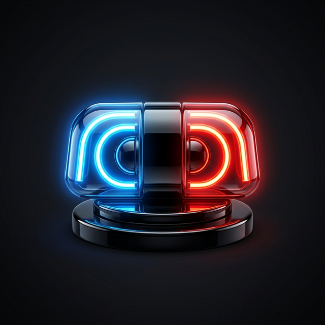

<div align="center">
  
  <h1>🚨 Doom Patrol</h1>
  <p><b>A highly-polished, privacy-first Chrome Extension that interrupts doom-scrolling with memes.</b></p>
</div>

---

## 📖 Overview

**Doom Patrol** acts as a hilarious, memetic "scroll police" for your browser. It monitors your behavior on highly addictive platforms (like Instagram Reels and YouTube Shorts) and interrupts continuous, mindless scrolling with a sleek glassmorphism overlay featuring a random meme and a funny roast.

### ✨ Key Features

- **Smart Velocity Tracking**: Detects rapid swiping/scrolling bursts (>20 rapid events) and intervenes early before your time threshold is hit.
- **Continuous Time Limits**: Choose preset limits (5m, 10m, 30m) or set a custom minute tracker.
- **Hardcore Friction Mode**: Forces you to wait 3 seconds before you can click the 'Dismiss' button on overlays, breaking the habit loop.
- **Premium UX/UI**: Built with a sleek, 3D dark-mode aesthetic inspired by top-tier developer platforms (Linear, Vercel). The overlay uses a **Shadow DOM** to prevent the host site's CSS (like Instagram's dark mode) from breaking the UI.
- **100% Privacy Focused**: Runs entirely on your local device. No telemetry, no external API calls, and zero tracking data leaves your browser. 

---

## 🛠️ Installation (For Developers & Users)

Since this extension is not currently on the Chrome Web Store, you can easily load it into your browser manually (unpacked).

### Step 1: Clone or Download
1. Clone this repository to your local machine:
   ```bash
   git clone https://github.com/your-username/doom-patrol.git
   ```
2. Or, click the **Code** button and select **Download ZIP**, then extract the folder on your computer.

### Step 2: Load into Chrome
1. Open Google Chrome.
2. In the URL bar, navigate to: `chrome://extensions/`
3. In the top right corner, toggle **Developer mode** to ON.
4. Click the **Load unpacked** button that appears in the top left.
5. Select the `doom-patrol` directory (the folder containing the `manifest.json` file).

*Boom! Doom Patrol is now actively protecting your attention span.* 🎉

---

## ⚙️ How to Configure

1. Click the **Puzzle Piece icon** in your Chrome toolbar.
2. Pin **Doom Patrol** to your toolbar for easy access.
3. Click the shiny neon Siren icon to view your daily usage dashboard.
4. Click **Configure Monitor** to open the settings.
5. From here, you can toggle which sites to track, change your time thresholds (or enter a custom one), and enable **Friction Protocol**.

---

## 📁 Repository Structure

```text
├── background.js         # Service worker tracking timers/alarms
├── content.js            # Content script tracking scroll velocity & injecting UI
├── manifest.json         # Extension Manifest V3 definition
├── popup                 # Dashboard UI
│   ├── popup.html
│   ├── popup.css
│   └── popup.js
├── settings              # Configuration Menu
│   ├── settings.html
│   ├── settings.css
│   └── settings.js
├── ui                    # The Shadow DOM Intervention Overlay
│   ├── overlay.html
│   └── overlay.css
├── memes                 # Local meme images (.jpg / .png)
└── icons                 # Extension logos
```

---

## 🔒 Do I need a `.env` file?

**No.** Doom Patrol does not require a `.env` file. Because this extension is completely privacy-focused, it does not communicate with external databases, servers, or APIs. It relies entirely on the local `chrome.storage.sync` and `chrome.storage.local` APIs built into the browser. 

---

## 🤝 Contributing

Want to add TikTok support? Got better memes? Feel free to open a Pull Request!

1. Fork the Project
2. Create your Feature Branch (`git checkout -b feature/AmazingFeature`)
3. Commit your Changes (`git commit -m 'Add some AmazingFeature'`)
4. Push to the Branch (`git push origin feature/AmazingFeature`)
5. Open a Pull Request

---

## 📜 License

Distributed under the MIT License. See `LICENSE` for more information.
